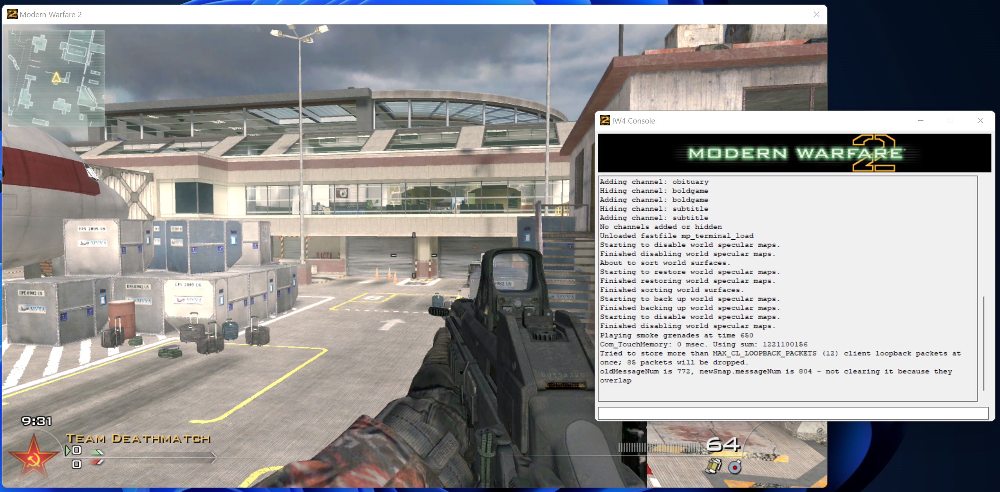

# OpenIW - IW Engine for Call of Duty® games.

[](LICENSE)
[](https://discord.gg/MaQE4QerkE)

*(Requires legally owned copies of each games, game assets are not provided.)*



# Official Releases
Official releases will not be available until the project reaches a playable state. You can follow the development progress on the [public discord](https://discord.gg/MaQE4QerkE).

# Build on Windows

```cmd
> git clone https://github.com/OpenIW/OpenIW
> git clone https://github.com/microsoft/vcpkg
>
> .\vcpkg\bootstrap-vcpkg.bat
> .\vcpkg\vcpkg install protobuf --triplet x86-windows
> .\vcpkg\vcpkg install protobuf --triplet x64-windows
> .\vcpkg\vcpkg integrate install
>
> cmake OpenIW -A Win32 -DVCPKG_TARGET_TRIPLET:STRING="x86-windows" -DCMAKE_TOOLCHAIN_FILE:STRING="vcpkg\scripts\buildsystems\vcpkg.cmake"
> start .\OpenIW.sln
```

# Documentation
[The documentation](https://openiw.github.io/OpenIW/) is generated from the repository source codes directly. It contains all necessary resources including source code snippets, details on execution of the programs, diagrammatic representation of program flow, and links to external resources.

# Credits
Thanks to all the people who contributed directly or indirectly in making this project possible.

<a href = "https://github.com/OpenIW/OpenIW/graphs/contributors">
  
</a>

# Legal
OpenIW is licensed under the [GPLv3](LICENSE.md) and is **not affiliated, associated, authorized, endorsed by, or in any way officially connected with Activision Blizzard, Inc**.
